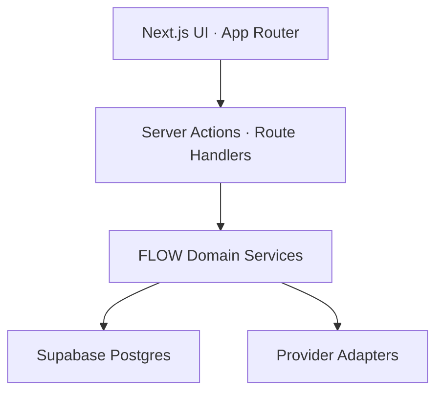
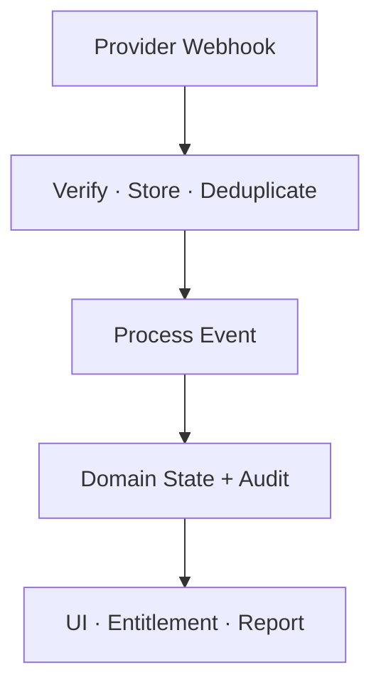

# FLOW Application Architecture

เอกสารนี้กำหนด Target Technology Stack, Runtime boundary, Module ownership และเส้นทางเปลี่ยนจาก Prototype ปัจจุบันไปสู่ Production architecture

## Target technology stack

| Layer | Decision | Rule |
|---|---|---|
| Web framework | Next.js App Router + React | ใช้ Server Component เป็นค่าเริ่มต้น; Client Component เฉพาะ interaction ที่จำเป็น |
| Language | TypeScript strict mode | ห้ามใช้ provider payload หรือ request body โดยไม่ parse/validate |
| Runtime | Node.js 22+ | ให้สอดคล้องกับ Supabase client support และกำหนด Version ใน repo/deployment |
| Authentication | Auth.js | เป็น Identity/Session authority เดียวสำหรับ Owner, Staff และ Platform Admin |
| Database | Supabase Postgres | ใช้ Migration, pooled server connection, tenant context และ RLS |
| Deployment | Vercel | แยก Preview/Production environment และ secret |
| Styling | Tailwind CSS | ใช้ Design token และ responsive/mobile-first contract |
| Components | shadcn/ui | Wrap component ที่ใช้ซ้ำใน FLOW UI layer; รักษา accessibility |
| SaaS billing | Stripe Billing | FLOW subscription, recurring card, invoice และ entitlement event |
| Merchant payments | Omise (Opn Payments) | Customer-to-merchant payment methods ที่เปิดตาม Merchant capability |
| Analytics | Vercel Analytics + domain metrics | Traffic analytics ห้ามแทน Operational/financial reporting |
| Formatting | Prettier | ใช้ร่วมกับ ESLint และ Markdown validation |

Supporting stack ที่ต้องเลือก/ติดตั้งก่อน Production

| Concern | Baseline | Status |
|---|---|---|
| Runtime validation | Zod หรือ equivalent schema validator | Required; package decision pending |
| Database access | Typed query layer + SQL migration | Required; ORM/query builder decision pending |
| Unit/component test | Vitest + Testing Library หรือ equivalent | Required; not yet established |
| End-to-end test | Playwright หรือ equivalent | Required; not yet established |
| Background jobs | Durable queue/worker | Required before payment retry/reconciliation; provider pending |
| Error monitoring | Central error/trace platform | Required before pilot; provider pending |
| Notification | Email/SMS/LINE adapter | Product-dependent; provider pending |

## Current implementation status

จาก `apps/web/next-flow/package.json` และ `.env.example` บน `main` ณ วันที่ทบทวน

| Capability | Current evidence | Target gap |
|---|---|---|
| Next.js/React/TypeScript | Implemented in application package | Add strict architecture boundaries and tests |
| Tailwind/shadcn | Packages are present | Establish shared Design System ownership |
| Authentication | Temporary internal email/password/session variables | Install and migrate to Auth.js; remove temporary authority |
| Supabase | Project URL/publishable key placeholders exist | Add server connection, migrations, tenant schema and RLS tests |
| Deployment | `vinext` and OpenAI Sites build path exists | Approve migration/coexistence plan before claiming Vercel production |
| Stripe | No application package/configuration evidence | Implement Billing adapter, webhook and sandbox tests |
| Omise/Opn | No application package/configuration evidence | Implement Merchant adapter, onboarding and sandbox tests |
| Vercel Analytics | Not installed | Add only after privacy/consent decision |
| Prettier | Not installed | Add config, scripts and CI check |

> README และ Architecture จึงใช้คำว่า **Target** จนกว่า Code, Environment, Test และ Release evidence จะครบทั้งสี่ด้าน

## Logical components



### Presentation layer

- Route groups แยก Customer, Operations, Management และ Platform Admin
- UI แสดงข้อมูลตาม Capability/Permission จาก Server ไม่อนุมานจากชื่อ Role ที่ Browser
- Form state แยกจาก Domain state; ทุก mutation ผ่าน validated command
- Payment form ใช้ Provider-hosted UI/tokenization; FLOW component ห้ามรับ PAN/CVV

### Application/BFF layer

- Auth.js session validation, active Tenant/Branch resolution และ request context
- Input validation, rate limit, idempotency key และ authorization
- Route Handler แยก Webhook endpoint ตาม Provider และ Purpose
- ส่ง Domain command/query; ห้ามใส่ business transition สำคัญไว้ใน UI callback
- Response ไม่คืน Secret, internal provider payload หรือ cross-tenant identifier

### Domain layer

- Shared Foundation: Organization, Membership, Permission, Customer, Workflow, Notification, File, Audit และ Entitlement
- FoodFlow: Order, Table/Session, Kitchen, Fulfillment และ Merchant payment allocation
- CareFlow: Booking, Queue, Staff/Resource, Service record และ sensitive-data gate
- JobFlow: Intake, Job, Quote/Approval, Execution, Part/QC และ Handover
- Billing: FLOW plan/subscription/invoice/entitlement lifecycle
- Merchant Payments: Provider-neutral payment/refund/dispute/reconciliation lifecycle

Domain layer ต้องไม่ import UI component และต้องเรียก Provider ผ่าน Port/Adapter interface เท่านั้น

### Data layer

- Supabase Postgres เป็น Source of truth ของ FLOW operational state
- ใช้ Server-side pooled connection; Vercel/serverless ใช้ transaction pooler
- ทุก Tenant-owned operation อยู่ใน transaction ที่ตั้ง Actor/Tenant context แบบ local
- RLS เป็น defense in depth และ test เป็น negative cross-tenant cases
- Financial event/audit ใช้ append-only record; Dashboard ใช้ projection/materialized view ตามความเหมาะสม
- Custom table/function ห้ามสร้างใน Supabase-managed `auth`, `storage` หรือ `realtime` schemas

### Integration layer

กำหนด Port ขั้นต่ำ

```ts
interface SaaSBillingProvider {
  createCheckout(input: CreateSubscriptionCheckout): Promise<CheckoutReference>
  createCustomerPortal(input: PortalRequest): Promise<PortalReference>
  verifyWebhook(input: RawWebhookRequest): Promise<VerifiedBillingEvent>
}

interface MerchantPaymentProvider {
  createPayment(input: MerchantPaymentRequest): Promise<PaymentAction>
  refund(input: RefundRequest): Promise<RefundReference>
  retrievePayment(reference: string): Promise<ProviderPaymentSnapshot>
  verifyWebhook(input: RawWebhookRequest): Promise<VerifiedPaymentEvent>
}
```

Stripe adapter ห้ามถูกเรียกจาก Merchant order service โดยตรง และ Omise adapter ห้ามเปลี่ยน FLOW subscription entitlement โดยตรง

## Target repository structure

```text
apps/web/next-flow/
├── src/app/                       # Routes, layouts, route handlers
├── src/components/                # FLOW UI and product components
├── src/modules/
│   ├── identity/                  # Auth.js and session context
│   ├── tenancy/                   # Organization, branch, membership
│   ├── entitlements/              # Product/bundle/topic resolution
│   ├── foodflow/                  # Food domain
│   ├── careflow/                  # Care domain
│   ├── jobflow/                   # Job domain
│   ├── billing/                   # Stripe SaaS billing only
│   └── merchant-payments/         # Omise customer-to-merchant only
├── src/integrations/
│   ├── stripe/
│   ├── omise/
│   └── supabase/
├── src/lib/                       # Cross-cutting utilities
└── tests/                         # Unit, contract, integration, e2e
supabase/
├── migrations/                    # Reviewed schema changes
├── seed.sql                       # Non-sensitive local/test fixtures
└── tests/                         # RLS and database contract tests
```

## Request and transaction rules

1. Parse request with schema
2. Authenticate actor or validate guest capability token
3. Resolve Tenant/Branch and Permission
4. Start transaction and set local Actor/Tenant context
5. Execute Domain command with idempotency key where applicable
6. Write state + audit/outbox atomically
7. Commit before non-transactional external side effects when using outbox
8. Return correlation ID; process notification/provider retry asynchronously

ห้ามเปิด Database transaction ค้างระหว่างรอ Customer redirect หรือ Provider network response ที่ยาว

## Webhook processing



- Ingress ต้องรับ Raw body ตามวิธี Verify ของ Provider
- บันทึก unique `(provider, purpose, event_id)` ก่อนตอบสำเร็จ
- ตอบ Provider เร็วหลัง Persist ได้; งานหนักไป Durable worker
- Worker เรียก Retrieve API เมื่อ Event ไม่พอหรือ Provider แนะนำ
- Out-of-order event ใช้ Provider timestamp/version และ transition guard
- Event ที่ Process ซ้ำต้องได้ผลลัพธ์เดิม
- Dead-letter/replay ต้องมี Operator permission และ Audit

## Environment contract

ชื่อจริงต้องยืนยันกับ SDK ก่อน Implement; ห้าม Commit ค่า Secret

| Scope | Examples | Exposure |
|---|---|---|
| Auth.js | `AUTH_SECRET`, OAuth/email provider secrets | Server only |
| Database | pooled `DATABASE_URL`, optional direct migration URL | Server/CI only |
| Supabase public | URL + publishable key เฉพาะ Feature ที่อนุมัติ | Browser allowed when explicitly needed |
| Supabase privileged | secret/service role | Server only; prefer narrow DB role |
| Stripe | secret key, webhook secret, price/product IDs | Server only except publishable key |
| Omise | secret key, public key, webhook configuration | Secret server only; public key client allowed |
| Vercel | environment/deployment metadata | Per environment |

Test และ Live credentials ต้องแยก Project/Environment; Preview ห้ามใช้ Production webhook secret หรือ Live payment key

## Quality gates

- `lint`, type-check, format check และ unit tests ผ่าน
- Build ผ่านด้วย Deployment target ที่อนุมัติ
- Schema migration forward/rollback strategy ได้รับ review
- RLS test ครบ Allow + Deny + cross-tenant + platform-support access
- Payment contract tests ครบ success, failure, timeout, duplicate, out-of-order, refund และ dispute
- No secret scan finding และ dependency audit ไม่มี unresolved critical issue
- Architecture docs, Environment contract และ Operations runbook อัปเดตพร้อม code

## References

- [Next.js App Router](https://nextjs.org/docs/app)
- [Auth.js Next.js integration](https://authjs.dev/reference/nextjs)
- [Supabase database connections](https://supabase.com/docs/guides/database/connecting-to-postgres)
- [Supabase Row Level Security](https://supabase.com/docs/guides/database/postgres/row-level-security)
- [Supabase changelog](https://supabase.com/changelog)
