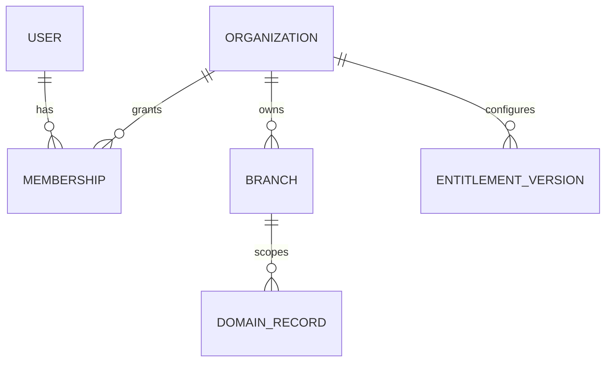
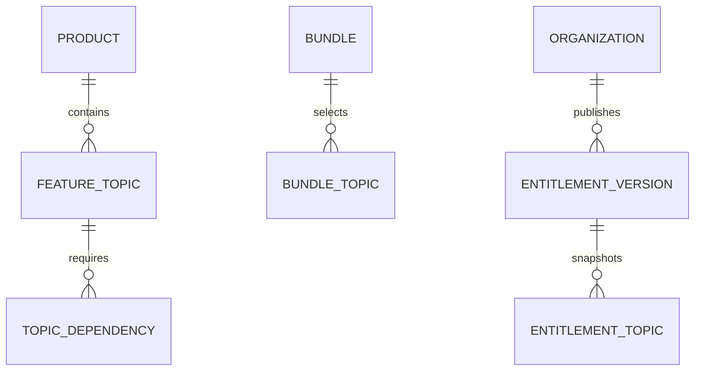
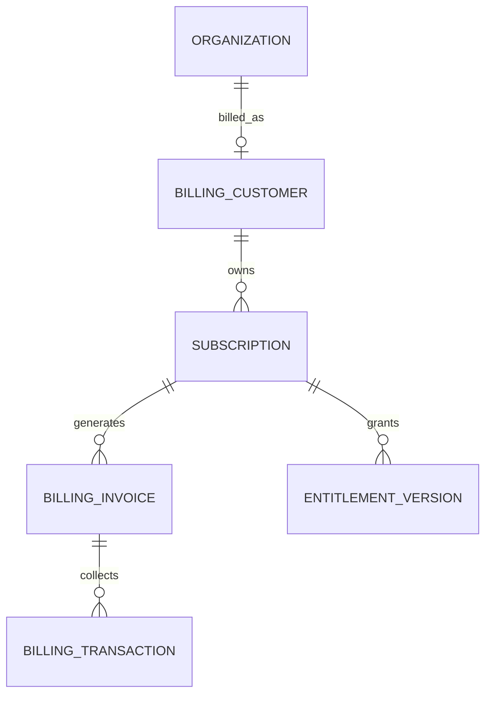
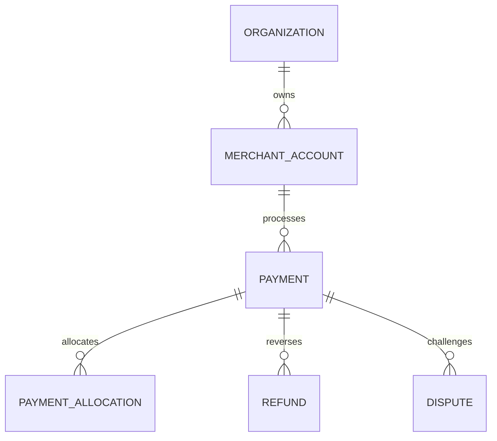

# FLOW Data Model

FLOW ใช้ Supabase Postgres เป็น Operational source of truth โดยออกแบบ Multi-tenancy, Product configuration และ Payment purpose separation ตั้งแต่ Schema/Constraint ไม่พึ่ง UI filter เพียงอย่างเดียว

> **Implementation status — Phase 2/12:** repository มี PostgreSQL/Supabase relational baseline สำหรับ `app`, `foodflow`, `payments`, `audit` และ `private` แล้ว รวม tenant/composite-FK structure, tenant-context RLS foundation, local synthetic seed และ pgTAP database tests. `billing`, `careflow`, `jobflow` ถูก reserve namespace เท่านั้น. Next.js runtime ยังใช้ FoodFlowState/localStorage และยังไม่ได้เชื่อม database; Kysely/pg runtime เป็น Phase 3, identity/permission-aware authorization เป็น Phase 4 และ operational persistence integration เป็น Phase 5–8.

## Schema ownership

| Schema | Ownership | Exposure |
|---|---|---|
| `app` | Tenant, branch, membership, customer, workflow, product configuration | Server-mediated; expose only approved views/functions |
| `foodflow` | Order, table/session, kitchen, fulfillment | Server-mediated |
| `careflow` | Booking, queue, resource, service/sensitive records | Server-mediated + stricter field/purpose controls |
| `jobflow` | Intake, job, quote, execution, part, QC, handover | Server-mediated |
| `billing` | FLOW customer, subscription, invoice, entitlement | Server-only; FLOW finance scope |
| `payments` | Merchant account, payment, refund, dispute, settlement reference | Server-only; merchant finance scope |
| `audit` | Immutable security/business events and webhook processing evidence | Restricted read; append through controlled path |
| `private` | Internal helper functions and lookup not exposed through Data API | Server/database internal only |

ห้ามสร้าง Custom object ใน Supabase-managed `auth`, `storage` หรือ `realtime` schemas และไม่ใช้ `public` เป็นที่วาง table แบบอัตโนมัติโดยไม่มี Exposure/RLS decision

## Identity and tenant model

| Entity | Purpose | Invariant |
|---|---|---|
| `app.users` | Internal profile linked to Auth.js identity | One stable internal user ID; no authorization from user-editable metadata |
| `app.organizations` | Tenant/legal/business scope | All business data resolves to one organization |
| `app.branches` | Operating/data scope below tenant | Branch belongs to exactly one organization |
| `app.memberships` | User ↔ organization/branch role assignment | Unique active membership per intended scope |
| `app.roles` / `role_permissions` | Permission bundles | Permission is server/database evaluated, not UI-only |
| `app.entitlement_versions` | Published Product/Bundle/Topic snapshot | Immutable after effective publication |
| `app.workflow_versions` | Published state/rule snapshot | Active records retain version reference |

### Tenant-key rules

- ทุก Tenant-owned table มี `tenant_id NOT NULL`
- Branch-owned row มีทั้ง `tenant_id` และ `branch_id`; Composite FK ยืนยันว่า Branch อยู่ Tenant เดียวกัน
- Cross-tenant reference ป้องกันด้วย Composite unique/FK เช่น `(tenant_id, id)` ไม่พึ่ง Code validation อย่างเดียว
- Index เริ่มจาก Access pattern เช่น `(tenant_id, branch_id, status, created_at desc)`
- ทุก Foreign key ที่ใช้ Join, Cascade หรือ RLS lookup ต้องมี Index
- Provider object ID ไม่ใช้เป็น Primary key และต้อง unique ภายใต้ Provider/Purpose/Account ที่ถูกต้อง

## Auth.js and Supabase boundary

Auth.js เป็น Identity/Session authority ส่วน Supabase ทำหน้าที่ Managed Postgres; ไม่เปิด Supabase Auth เป็น Login authority คู่ขนานโดยไม่มี ADR

Target request contract

1. Next.js server ตรวจ Auth.js session
2. Resolve internal `user_id`, `tenant_id`, `branch_id`, membership และ permission
3. เปิด transaction ผ่าน pooled connection
4. ตั้ง `SET LOCAL app.actor_id`, `app.tenant_id`, `app.branch_id` จากค่าที่ Server ตรวจแล้ว
5. Query ทำงานภายใต้ least-privilege role + RLS
6. Transaction จบแล้ว Context ถูกทิ้ง ไม่รั่วไป request ถัดไป

Browser ไม่เรียก Domain tables ผ่าน Supabase Data API โดยตรงใน Baseline นี้ หากอนาคตเปิด Direct client access ต้องมี JWT/RLS design และ ADR แยก

## Product configuration model

| Entity | Key fields |
|---|---|
| `products` | stable product code: FLOW Core, FoodFlow, CareFlow, JobFlow |
| `feature_topics` | catalog Topic ID, type, priority, lifecycle status |
| `bundles` | product, bundle code, version, recommendation status |
| `bundle_topics` | bundle version, topic, default/conditional/excluded rule |
| `topic_dependencies` | source topic, target topic/capability, rule type, condition, reason |
| `entitlement_versions` | tenant, source subscription/config, effective time, supersedes version |
| `entitlement_topics` | resolved topic, source bundle/manual/dependency, enabled state |

Auto-enabled Dependency ต้องเก็บ `source_topic_id` และ reason เพื่ออธิบายได้ว่าถูกเปิดเพราะอะไร เมื่อปิด Topic ระบบต้องตรวจ Reference จาก Bundle, Workflow และ Active domain records

## SaaS billing model

Suggested `billing` entities

| Entity | Required fields/invariants |
|---|---|
| `billing.customers` | organization unique, Stripe customer ref unique |
| `billing.subscriptions` | customer, provider subscription ref, internal plan/version, normalized + provider status |
| `billing.invoices` | subscription, provider invoice ref, amount/currency, period, due/paid timestamps |
| `billing.transactions` | invoice, provider payment ref, immutable amount/currency/event linkage |
| `billing.entitlement_links` | subscription item/price ↔ entitlement version |

Billing tablesไม่มี Merchant customer Order/Booking/Job payment และ Merchant staff ต้องไม่เห็น FLOW commercial metadata ยกเว้น Owner ที่ได้รับสิทธิ์ Billing

## Merchant payment model

Suggested `payments` entities

| Entity | Required fields/invariants |
|---|---|
| `merchant_accounts` | tenant, provider, provider account ref, settlement model, capability state |
| `payment_method_capabilities` | merchant account, method, enabled/eligible/disabled reason, verified timestamp |
| `payments` | tenant/account, business reference, amount minor unit, currency, normalized/provider status |
| `payment_allocations` | payment ↔ order/booking/job/deposit/invoice, allocated amount |
| `refunds` | original payment, amount, reason, approver, provider ref/status |
| `disputes` | original payment, provider case, amount, deadline/status |
| `settlement_references` | merchant account, provider batch/period, expected/actual totals, reconciliation state |

Constraints ขั้นต่ำ

- `amount_minor > 0`; refund amount รวมไม่เกิน captured/succeeded amount ตาม Provider rule
- ISO currency เก็บเป็น uppercase 3-character code
- Sum allocation ไม่เกิน Payment amount; settlement/fee allocation แยกจาก Business allocation
- Unique provider reference มี Provider + Purpose + Account scope
- Merchant account `tenant_id` ต้องตรง Payment/Refund/Dispute tenant
- Original transaction financial facts ไม่ถูกแก้เมื่อ Refund/Dispute; สร้าง Event/record เพิ่ม

## Webhook and outbox model

| Entity | Purpose | Key constraint |
|---|---|---|
| `audit.webhook_events` | Durable ingress evidence | Unique `(provider, purpose, provider_event_id)` |
| `audit.webhook_attempts` | Process/retry outcome | Event + attempt number unique |
| `audit.domain_events` | Immutable state transition evidence | Tenant, aggregate, version, correlation ID |
| `app.outbox_events` | External side effects after commit | Unique operation/idempotency key |

Webhook payload เก็บเท่าที่จำเป็น อาจเก็บ hash + redacted body + Provider object reference แทน Full payload เมื่อ Full payload มีข้อมูลละเอียดเกินวัตถุประสงค์

## Data types and naming

- Identifier: `uuid` สำหรับ Public/distributed entity; Provider reference เป็น `text`
- Money: `bigint amount_minor` + `char(3)`/checked `text currency`; ห้ามใช้ floating point
- Time: `timestamptz` และเก็บ Provider occurred time แยกจาก received/processed time
- Status: constrained text/enum ที่เปลี่ยนผ่าน Migration ได้อย่างปลอดภัย
- Flexible metadata: `jsonb` เฉพาะข้อมูลที่ไม่เป็น Core query/constraint; สร้าง index ตาม Access pattern
- Identifier/column ใช้ lowercase `snake_case`
- Soft-delete/retention state ใช้ explicit lifecycle fields; ไม่ใช้ `is_deleted` เพื่อหลบกฎบัญชี/Audit

## RLS policy baseline

ทุก Table ใน Exposed schema ต้อง Enable RLS และ Table สำคัญควร Force RLS ตาม Threat model

Policy ต้องตรวจ

- Authenticated actor ไม่พอ ต้องตรวจ Tenant membership/permission/branch/assignment
- `UPDATE` มีทั้ง `USING` และ `WITH CHECK`
- Policy function call ที่คงที่ต่อ statement ใช้ cached/select pattern ตาม Supabase guidance
- Column ที่ใช้ RLS predicate มี Index
- Complex helper อยู่ `private` schema, fixed `search_path`, explicit caller check และ revoke default execute
- View ที่เปิดผ่าน Data API ใช้ `security_invoker` เมื่อรองรับ หรือ revoke จาก public roles
- Service/secret role ไม่ใช้ใน Browser และไม่ใช้เพื่อหลบ RLS bug

Phase 2 implements only tenant matching/default-deny context using `flow_runtime`; membership, permission and branch/assignment authorization remain Phase 4.

Test matrix ขั้นต่ำ

| Test | Expected |
|---|---|
| Same tenant + allowed permission | Allow |
| Same tenant + wrong branch/assignment | Deny |
| Same tenant + missing permission | Deny |
| Different tenant with guessed ID | Deny |
| Deactivated membership/session | Deny |
| Platform support without active JIT grant | Deny |
| Platform support with scoped, unexpired grant | Allow only approved scope + audit |

## Connection management

- Vercel/serverless runtime ใช้ Supabase transaction pooler
- Migration/administrative operation ใช้ approved direct/session connection แยก Credential
- Transaction pooling ไม่รองรับ prepared statements บางรูปแบบ; Driver config ต้องตรงกับ Supabase current docs
- จำกัด Connection pool และ Timeout; ห้ามสร้าง direct connection ใหม่แบบไม่จำกัดต่อ Request
- Long-running report/export ใช้ job/projection ไม่ถือ Web request/transaction ยาว

## Retention and deletion

| Data class | Default handling |
|---|---|
| Financial invoice/payment/refund/dispute | Retain per accounting/provider/legal policy; immutable facts |
| Audit/security event | Retain based on risk and incident investigation needs; restrict access |
| CareFlow sensitive record/media | Explicit purpose, consent/authority, shortest approved retention, field/file access audit |
| Workforce location/evidence | Job/shift purpose only; no off-duty tracking; short retention |
| Customer operational record | Tenant policy + privacy request workflow + legal holds |
| Provider webhook raw payload | Minimize/redact; retain only for troubleshooting/reconciliation window |

Deletion request ต้องแยก Erase, Anonymize, Restrict และ Legal hold และห้ามทำลาย Financial/Audit evidence ที่กฎหมาย/สัญญาต้องเก็บ

## Migration and review rules

- Schema change ทุกครั้งผ่าน versioned migration ใน Git
- DDL และ data backfill แยกเมื่อเสี่ยง lock/timeout
- Add constraint/index โดยคำนึงถึง existing data และ Production lock
- Foreign key/index/RLS/advisor findings ต้อง review ก่อน merge
- Migration ต้องระบุ forward, rollback/roll-forward, data validation และ owner
- Production schema ห้ามแก้เฉพาะใน Dashboard โดยไม่ย้อนกลับมาเป็น Migration

## Open decisions

- Typed query runtime wiring and generated database types (Phase 3)
- Identity mapping and permission/branch RLS (Phase 4)
- Durable queue/outbox worker implementation
- Partitioning/archiving threshold สำหรับ Audit/Webhook/Payment events
- Backup/PITR tier, restore RTO/RPO และ regional/data residency
- Analytics warehouse/export strategy เมื่อ Operational Postgres ไม่เพียงพอ

## References

- [Supabase Row Level Security](https://supabase.com/docs/guides/database/postgres/row-level-security)
- [Supabase Data API security](https://supabase.com/docs/guides/api/securing-your-api)
- [Supabase database connections](https://supabase.com/docs/guides/database/connecting-to-postgres)
- [PostgreSQL data types](https://www.postgresql.org/docs/current/datatype.html)
- [PostgreSQL constraints](https://www.postgresql.org/docs/current/ddl-constraints.html)
