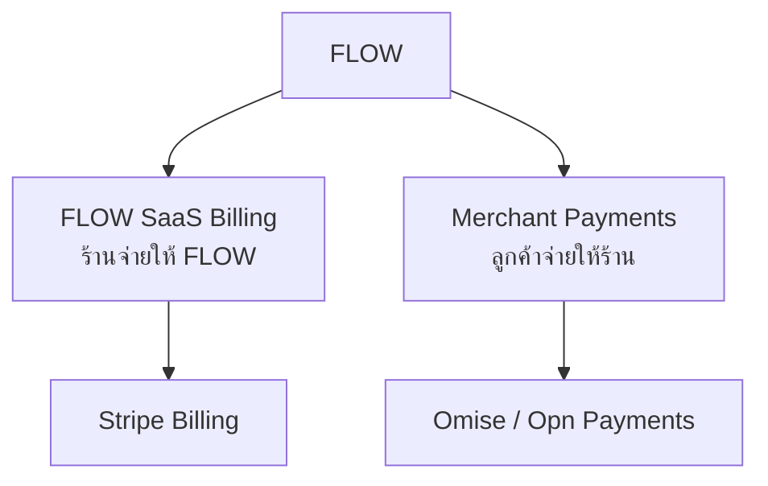
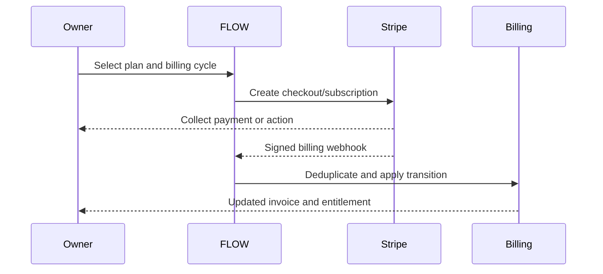
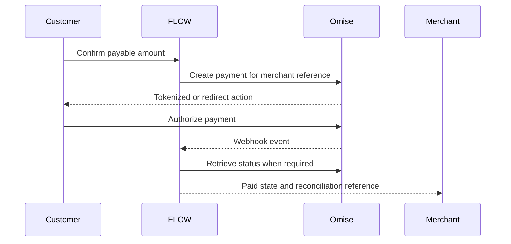

# FLOW Payment Architecture

FLOW แยกการชำระเงินเป็น 2 Bounded Context ที่มีผู้ขาย ผู้รับเงิน Account, Credential, Webhook, Ledger และ Reconciliation คนละชุดอย่างเด็ดขาด



## Decision summary

| Dimension | FLOW SaaS Billing | Merchant Payments |
|---|---|---|
| Commercial purpose | ค่าสมาชิก/บริการ FLOW | ค่าสินค้า บริการ มัดจำ หรือ Job ของร้าน |
| Payer | Merchant organization | Merchant customer |
| Merchant/seller | FLOW | ร้าน/นิติบุคคลที่ให้บริการลูกค้า |
| Provider | Stripe | Omise (Opn Payments) |
| Account ownership | FLOW Stripe account | Merchant-owned account หรือ approved PayFac submerchant model |
| Core object | Plan → Subscription → Invoice → Entitlement | Order/Booking/Job → Payment → Refund/Dispute |
| Settlement beneficiary | FLOW | Merchant ตาม Provider contract |
| Source-of-truth webhook | Stripe Billing webhook | Omise transaction webhook/status retrieval |
| Ledger/schema | `billing.*` | `payments.*` |

## Correction to the initial diagram

### Stripe Connect

`Connect` ไม่ใช่ความสามารถของ SaaS Billing โดยตรง แต่เป็น Platform/Marketplace capability สำหรับ onboarding connected accounts, routing money และ payout ให้หลายฝ่าย จึงกำหนดเป็น **Deferred / separate ADR** ไม่รวมใน MVP ที่ใช้ Stripe เพื่อเก็บค่าสมาชิก FLOW

หากอนาคต FLOW ต้องใช้ Stripe รับเงินแทนร้านหรือแบ่งเงินหลายฝ่าย ต้องทบทวน Omise boundary, Merchant of Record, KYC/KYB, Fee, Refund, Chargeback, Tax, Settlement และกฎหมายก่อน ห้ามเปิด Connect เพียงเพราะ SDK รองรับ

### Stripe PromptPay

Stripe รองรับ PromptPay ในไทยและใช้ชำระ Invoice ได้ แต่ Real-time payment methods ใช้กับ Subscription แบบ `send_invoice` ไม่ใช่ Automatic recurring debit แบบ Card ดังนั้น

- Card เป็น Baseline สำหรับ `charge_automatically` และ Auto-renewal
- PromptPay เป็น Manual invoice/payment option ที่ลูกค้าต้องดำเนินการแต่ละรอบ
- ระบบต้องมี Reminder, Due date, Grace period และ Entitlement policy สำหรับรอบที่ยังไม่ชำระ
- UI ห้ามเรียก PromptPay ว่า “ตัดอัตโนมัติ”

ดู [Stripe PromptPay](https://docs.stripe.com/payments/promptpay) และ [Stripe real-time payments](https://docs.stripe.com/payments/real-time)

## Payment-method capability matrix

รายการช่องทางเปลี่ยนตามประเทศ ประเภทธุรกิจ Contract, Currency, Provider review และ Account activation ระบบต้องอ่าน Merchant capability/configuration ไม่ Hard-code ว่าทุกร้านใช้ได้

| Payment method | SaaS Billing / Stripe | Merchant / Omise | Default policy |
|---|---|---|---|
| Credit/debit card | Yes; recurring baseline | Yes | P0 เมื่อ Merchant ผ่าน activation |
| PromptPay | Invoice/manual payment | Yes | Merchant P0; SaaS P1 manual invoice |
| Mobile Banking | Not baseline | K PLUS, SCB EASY, Krungthai NEXT, Bualuang, Krungsri ตาม provider list | Opt-in per merchant |
| LINE Pay | Not baseline | Listed by Omise Thailand | Opt-in; verify activation/fee |
| ShopeePay | Not baseline | Listed by Omise Thailand | Opt-in |
| TrueMoney | Not baseline | Listed by Omise Thailand | Opt-in; verify business category |
| WeChat Pay | Not baseline | Listed by Omise Thailand | Opt-in; useful for eligible customer segment |
| Card installment | Not SaaS baseline | Listed; plan/bank/amount rules apply | Opt-in for suitable ticket size |
| SPayLater / Atome / PayNext Extra | Not SaaS baseline | Listed BNPL methods | P2; explicit eligibility, fee and risk review |
| Stripe Connect | Deferred platform capability | Not applicable | Separate architecture/legal decision |

รายการ Omise อ้างอิงจาก [Omise Thailand pricing and payment methods](https://www.omise.co/en/pricing/thailand) ณ วันที่ทบทวน เอกสารนี้ไม่รับประกันว่า Live account ของร้านได้รับอนุมัติทุกช่องทาง

## FLOW SaaS Billing design

### Scope

- Product/Price catalog ที่ Stripe และ internal mapping
- Checkout, Subscription, Invoice และ Customer Portal
- Trial, Upgrade, Downgrade, Proration และ Cancellation policy
- Payment failure, Dunning/Retry, Grace period และ Entitlement transition
- Tax invoice/receipt ownership ต้องกำหนดร่วมกับ Finance/Tax
- Credit note/refund และ reconciliation

### Subscription flow



Redirect success page แสดงได้เพียง “กำลังยืนยัน” จนกว่า Verified webhook/retrieval จะยืนยัน Billing state

### Entitlement policy

| Billing state | FLOW action |
|---|---|
| `trialing` | Grant trial entitlement version with expiry |
| `active` + paid/current invoice | Grant purchased Product/Bundle/Topic entitlements |
| `past_due` | Apply configured grace policy; alert Owner; do not erase historical data |
| `unpaid` | Restrict paid operations according to policy; preserve export/billing access |
| `paused` | Freeze new paid operations; define data/read access explicitly |
| `canceled` | End entitlement at configured effective time; preserve retention/export contract |

Stripe event ช่วยขับ State แต่ Entitlement projection ของ FLOW ต้องเก็บ Internal version และ Audit ของตนเอง

## Merchant Payments design

### Merchant account model

อนุญาต 2 รูปแบบหลัง Contract approval เท่านั้น

1. **Merchant-owned gateway account** — ร้านผ่าน KYC/KYB กับ Omise และ Settlement เข้าบัญชีร้าน; FLOW เก็บ Account reference/capability
2. **Opn PayFac/submerchant model** — ใช้เมื่อ Opn อนุมัติ FLOW เป็น Platform พร้อม onboarding, settlement, reserve, dispute และ compliance contract

ห้ามใช้ FLOW merchant account กลางรับเงินทุก Tenant แล้วโอนต่อเองเป็น Default architecture

### Customer payment flow



### Business linkage

ทุก Merchant payment ต้องมี

- `tenant_id`, `merchant_account_id`, `branch_id` เมื่อเกี่ยวข้อง
- `business_reference_type`: `order`, `booking`, `job`, `deposit`, `invoice`
- `business_reference_id` และ immutable human-readable reference
- Amount เป็น integer minor unit + ISO currency
- Provider, provider transaction/source reference และ idempotency key
- Payment allocation เมื่อ 1 Payment ชำระหลายรายการหรือ 1 รายการแบ่งจ่ายหลาย Payment
- Actor/source channel, timestamps, current normalized status และ raw-event reference

## Provider-neutral state model

### Payment

```text
created
  → requires_action
  → pending
  → succeeded
  → partially_refunded
  → refunded

created/requires_action/pending
  → failed | expired | canceled

succeeded
  → disputed
```

Provider status map ต้องอยู่ใน Adapter และมี contract tests ห้ามกระจายเงื่อนไขชื่อสถานะ Provider ใน Product domain

### State transition rules

- `succeeded` ต้องมาจาก Verified webhook หรือ server-side retrieve ไม่ใช่ Client parameter
- Amount/currency/merchant/business reference ต้องตรงกับ Expected payment ก่อนปล่อย Order/Booking/Job gate
- Final state ห้ามย้อนกลับด้วย Event เก่า; ใช้ event time/version และ transition guard
- Refund ไม่แก้ยอด Original transaction; สร้าง Refund record และคำนวณ net projection
- Dispute/chargeback สร้าง Case แยกและอาจ Reopen finance workflow
- Cash/manual transfer ถ้าเพิ่มในอนาคตต้องมี Evidence, approver และ reconciliation rule แยก ไม่ปลอมเป็น Provider success

## Webhook and idempotency contract

แยก endpoint อย่างน้อย

```text
/api/webhooks/stripe/billing
/api/webhooks/omise/merchant-payments
```

ทุก endpoint ต้อง

1. อ่าน Raw request ตาม Provider verification requirement
2. Verify signature/secret/source ตามวิธีที่ Provider รองรับ
3. Persist event ก่อน process และบังคับ unique `(provider, purpose, provider_event_id)`
4. ตอบ 2xx เฉพาะเมื่อ Event ถูกเก็บอย่างทนทานหรือ process สำเร็จตาม Contract
5. Process แบบ idempotent และรองรับ Duplicate/out-of-order delivery
6. เก็บ correlation ID, provider object ID, received/occurred timestamp, processing result และ retry count
7. Redact token, personal/payment secret และกำหนด retention ของ raw payload
8. มี replay/dead-letter tool ที่จำกัดสิทธิ์และมี Audit

Outbound create/refund request ต้องมี Idempotency key ที่ stable ต่อ Business operation ไม่สร้าง key ใหม่ทุก retry

## Ledger and reconciliation

Ledger ของ FLOW เป็น Operational subledger ไม่ใช่บัญชีแยกประเภททางกฎหมายจนกว่า Finance อนุมัติ

| Record | Immutable fields | Mutable projection |
|---|---|---|
| Charge/payment event | Purpose, tenant, provider ref, amount, currency, occurred time | Normalized status |
| Refund event | Original transaction, amount, reason, provider ref | Processing status |
| Dispute event | Original transaction, provider case ref, amount | Case status/deadline |
| Settlement reference | Merchant account, period, provider batch/ref | Reconciled flag/result |
| Billing invoice snapshot | Stripe invoice/customer/subscription ref, total, currency | Collection/status projection |

Reconciliation jobs ต้องตรวจอย่างน้อย

- Internal succeeded amount เทียบ Provider succeeded/settled amount
- Refund/dispute ที่ Provider มีแต่ Internal ไม่มี และกลับกัน
- Duplicate provider reference หรือ business allocation เกินยอด
- Currency/merchant account mismatch
- Webhook lag, unprocessed/dead-letter event และ stale pending payment
- SaaS invoice paid แต่ Entitlement ไม่ Active หรือ Entitlement Active โดยไม่มี valid billing state

## Refund, cancellation and dispute ownership

| Operation | Initiator | Approval | Provider action | FLOW result |
|---|---|---|---|---|
| SaaS refund/credit | FLOW Finance/Support | Billing policy | Stripe refund/credit note | Billing ledger + entitlement review |
| Merchant refund | Authorized merchant role | Merchant refund policy | Omise refund when method supports | Refund record + Order/Booking/Job status |
| Void/cancel pending | System or authorized staff | State-dependent | Cancel/expire when provider supports | Release business gate/reservation |
| Dispute | Provider/cardholder | Finance case owner | Evidence/action per provider | Case, alert, reserve/revenue impact |

FLOW Platform Admin ห้ามคืนเงินของร้านโดยไม่มี explicit delegated permission, reason และ audit

## Security and compliance boundary

- ใช้ Hosted/tokenized payment element ของ Provider เพื่อลด PCI scope
- PAN/CVV ห้ามผ่าน FLOW server, database, log, analytics หรือ support tool
- Secret key/webhook secret แยก Test/Live และ Stripe/Omise
- Live secret อยู่ใน Server-only environment; rotate ได้และมี owner
- Log ใช้ internal/provider reference ไม่บันทึก token หรือ full payload โดยไม่จำเป็น
- Merchant onboarding/KYC/KYB, Settlement, Tax, Reserve และ Restricted business เป็น Provider/Legal gate
- Refund, payout/settlement change และ credential change ต้องใช้ step-up auth และ audit
- Payment data retention ต้องสอดคล้อง Provider contract, accounting/tax และ privacy policy

เอกสารนี้เป็น Technical architecture ไม่ใช่คำวินิจฉัยทางกฎหมายหรือการรับรอง PCI-DSS

## Go-live checklist

### Stripe SaaS Billing

- [ ] FLOW Stripe account ผ่าน activation/verification
- [ ] Product/Price/Tax/Invoice ownership และ cancellation policy อนุมัติ
- [ ] Test/Live environment และ webhook secret แยกกัน
- [ ] Card recurring, PromptPay invoice, failed payment, retry และ grace policy ทดสอบ
- [ ] Upgrade/downgrade/proration/cancel/refund test ผ่าน
- [ ] Verified webhook drives entitlement; duplicate/out-of-order/replay tests ผ่าน
- [ ] Finance reconciliation และ support runbook พร้อม

### Omise Merchant Payments

- [ ] Merchant account/PayFac legal model อนุมัติ
- [ ] Merchant KYC/KYB และ Settlement beneficiary ถูกต้อง
- [ ] Payment method capability อ่านจาก account/config ไม่ hard-code
- [ ] PromptPay/card baseline และ optional methods ทดสอบบนอุปกรณ์จริงใน Sandbox/Pilot
- [ ] Amount/currency/tenant/merchant reference validation ผ่าน
- [ ] Refund, expired QR, timeout, duplicate webhook และ stale pending tests ผ่าน
- [ ] Daily reconciliation, alert และ incident owner พร้อม
- [ ] No PAN/CVV/log leakage และ Security review ผ่าน

## Out of scope until separate approval

- Stripe Connect หรือการย้าย Merchant Payments ไป Stripe
- FLOW ถือเงิน/แบ่งเงิน/จ่ายออกให้ Merchant ด้วยบัญชีกลาง
- Multi-party split payment/tip allocation/payout orchestration
- Cross-border settlement, FX, crypto หรือ stored-value wallet ของ FLOW
- Lending/BNPL underwriting โดย FLOW
- Automatic approval of high-risk refund/dispute

## References

- [Stripe Billing](https://docs.stripe.com/billing)
- [Stripe subscription lifecycle](https://docs.stripe.com/billing/subscriptions/overview)
- [Stripe subscription webhooks](https://docs.stripe.com/billing/subscriptions/webhooks)
- [Stripe PromptPay](https://docs.stripe.com/payments/promptpay)
- [Stripe real-time payment methods](https://docs.stripe.com/payments/real-time)
- [Stripe Connect](https://docs.stripe.com/connect)
- [Omise Thailand payment methods and pricing](https://www.omise.co/en/pricing/thailand)
- [Omise API documentation](https://docs.omise.co/)
