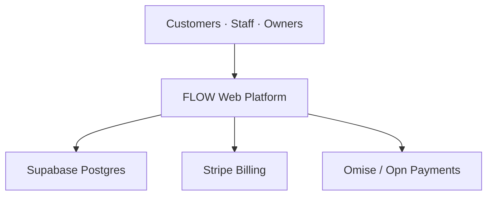
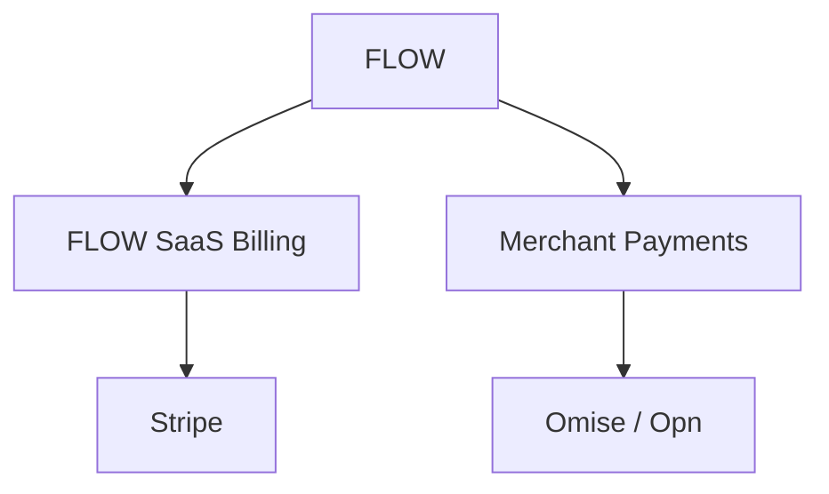

# FLOW System Context

FLOW เป็น Multi-tenant SaaS/PWA ที่เชื่อม Customer Entry กับ Workflow ของร้าน โดยมี 3 Vertical Product บน Shared Foundation เดียวกัน ได้แก่ FoodFlow, CareFlow และ JobFlow

## Actors

| Actor | เป้าหมาย | Authentication | Data boundary |
|---|---|---|---|
| Customer | สั่งอาหาร จองบริการ แจ้งงาน ติดตาม และชำระเงิน | Guest token, OTP หรือ Customer account ตาม Workflow | เฉพาะ Transaction/Booking/Job ที่ตนมีสิทธิ์ |
| Staff | รับงาน ปฏิบัติงาน อัปเดตสถานะ และรับชำระ | Auth.js session | Tenant + Branch + Role + Assignment |
| Owner/Admin | ตั้งค่า Product, Bundle, Topic, Workflow, ราคา และรายงาน | Auth.js session + step-up auth สำหรับงานเสี่ยง | Tenant ที่เป็นสมาชิกและ Scope ที่ได้รับมอบหมาย |
| FLOW Platform Admin | Support, Billing, Incident และ Platform operations | แยก Platform role + MFA + audit | เข้าถึงเท่าที่จำเป็นและมีเหตุผล/เวลาอนุมัติ |
| Finance/Operations | Reconcile, Refund, Dispute และ Settlement review | Auth.js session + restricted role | Billing purpose ที่รับผิดชอบเท่านั้น |
| External Provider | Identity, Payment, Hosting, Database และ Analytics | Provider-specific credential | ตาม Contract และ Data processing purpose |

## System landscape

ระบบภายนอกอื่น เช่น Email/SMS/LINE, Maps, Accounting, Delivery platform และ Observability เป็น Optional integration และต้องมี Integration contract แยกก่อน Production

## Core system boundary

FLOW รับผิดชอบ

- Product configuration, Bundle/Topic dependency และ Entitlement
- Tenant, Branch, Membership, Role และ Permission
- FoodFlow/CareFlow/JobFlow workflow state และ audit
- Provider-neutral Payment state, Order/Booking/Job linkage และ reconciliation reference
- Customer/Staff UI, API/BFF, Notification orchestration และ Reporting projection

Provider รับผิดชอบ

- Stripe: Subscription, Invoice, payment collection และ provider-side billing state ของ FLOW SaaS
- Omise/Opn: Tokenization, payment authorization/collection และ provider-side transaction ของร้าน
- Supabase: Managed Postgres infrastructure, backup capability และ optional Storage/Realtime
- Vercel: Web runtime, deployment, edge/CDN และ web analytics ตามแผนที่เปิดใช้
- Auth.js/Identity provider: Authentication flow และ Session contract ตาม Configuration

FLOW ต้องไม่

- เก็บ PAN, CVV, Bank credential หรือ Wallet credential
- ยืนยันการชำระเงินจาก Browser redirect เพียงอย่างเดียว
- รวมเงินที่ลูกค้าจ่ายให้หลายร้านเข้า FLOW operating account แล้วแบ่งจ่ายเองโดยไม่มี Platform/PayFac contract และ Legal approval
- ใช้ SaaS invoice เป็นหลักฐานแทน Merchant order payment หรือกลับกัน
- เปิดข้อมูลข้าม Tenant/Branch จากการ Filter ที่ UI เพียงชั้นเดียว

## Payment context

| Context | ผู้จ่าย | ผู้รับประโยชน์/ผู้ขาย | Provider | เงินผูกกับ |
|---|---|---|---|---|
| FLOW SaaS Billing | ร้าน/องค์กรผู้ใช้ FLOW | FLOW | Stripe | Plan, Subscription, Invoice, Entitlement |
| Merchant Payments | ลูกค้าของร้าน | ร้าน/สาขาตาม Merchant contract | Omise/Opn | Order, Booking, Job, Deposit, Refund |

รายละเอียดและข้อยกเว้นอยู่ใน [Payment Architecture](payment-architecture.md)

## Trust boundaries

| Boundary | ความเสี่ยงหลัก | Control ขั้นต่ำ |
|---|---|---|
| Browser ↔ FLOW | Session theft, tampering, abuse | TLS, secure cookie, CSRF protection, validation, rate limit, CSP |
| FLOW ↔ Database | Tenant escape, over-privilege | Pooled connection, least-privilege role, transaction context, RLS, audit |
| FLOW ↔ Payment provider | Forged webhook, replay, duplicate charge | Signature/secret verification, raw-body handling, unique event ID, idempotency |
| FLOW ↔ External integration | Credential leak, wrong scope, retry storm | Scoped secret, allowlist, timeout, circuit breaker, retry budget, monitoring |
| Staff ↔ Customer data | Excess access, sensitive-data exposure | RBAC/ABAC, branch/assignment scope, field masking, purpose and audit |
| Platform admin ↔ Tenant | Support overreach | Just-in-time access, reason, approval, expiry, immutable audit |

## Critical end-to-end flows

### Staff authentication

1. User authenticates through Auth.js provider
2. Server validates Session and resolves Membership
3. User selects/receives Active Tenant and Branch scope
4. Server starts Database transaction with verified Actor/Tenant context
5. RLS and Permission policy evaluate every operation
6. Sensitive action creates Audit event and may require step-up authentication

### FLOW subscription

1. Owner selects Plan/Bundle
2. FLOW creates Stripe Checkout/Subscription context under FLOW Stripe account
3. Stripe collects payment and emits verified webhook
4. FLOW deduplicates event and updates Billing projection
5. Entitlement engine publishes/grants the matching Product/Topic version
6. Failed, past-due, paused or canceled state follows a defined grace/restriction policy

### Merchant customer payment

1. Customer confirms Order/Booking/Job amount
2. FLOW creates Merchant payment intent under the correct Merchant account/reference
3. Customer completes provider-hosted or tokenized payment flow
4. Omise/Opn sends completion event; FLOW verifies and retrieves status when required
5. Payment state updates Ledger and releases the relevant business gate
6. Refund/Dispute/Reconciliation remains linked to the original Merchant transaction

## Non-functional baseline

| Area | Baseline |
|---|---|
| Availability | Payment webhook ingestion and read-only operations must degrade independently from non-critical analytics |
| Consistency | Financial and entitlement transitions use transaction + idempotency; UI projections may be eventually consistent |
| Auditability | Actor, tenant, purpose, source event, previous/new state and correlation ID are traceable |
| Privacy | Collect minimum data, enforce retention, restrict sensitive CareFlow/Workforce location evidence |
| Portability | Domain model stores provider-neutral status plus external references, not provider payload as primary model |
| Observability | Structured log, metric, trace/correlation ID, webhook lag, failure rate and reconciliation mismatch alerts |

## Open context decisions

- Legal/contract model สำหรับร้านหลาย Tenant: Merchant-owned Omise account หรือ Opn PayFac submerchant
- Customer authentication policy แยกตาม Vertical และระดับความเสี่ยง
- Notification providers และ Data residency/retention ที่ต้องใช้
- Background job/queue provider สำหรับ webhook processing และ retry
- Accounting/tax integration และ Source of truth ของใบกำกับภาษี
